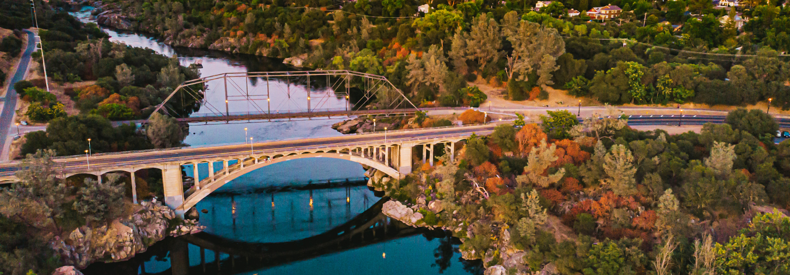
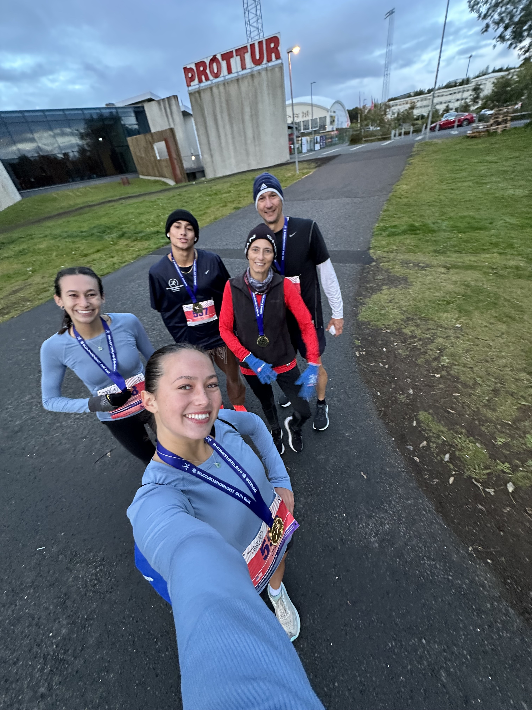
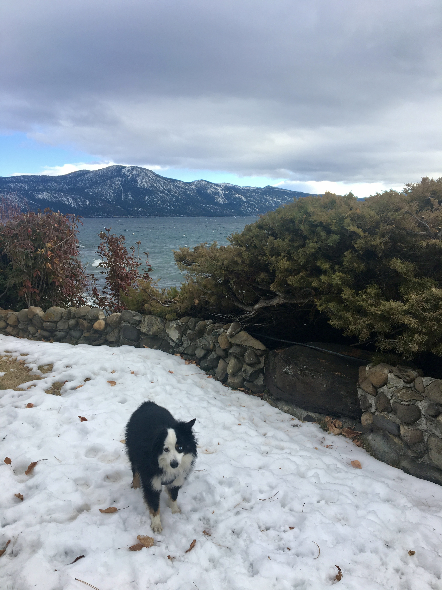
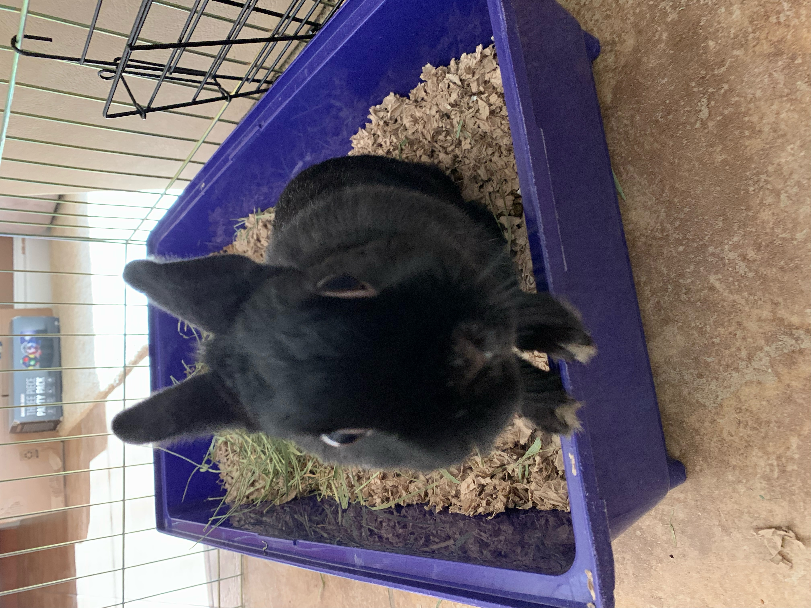
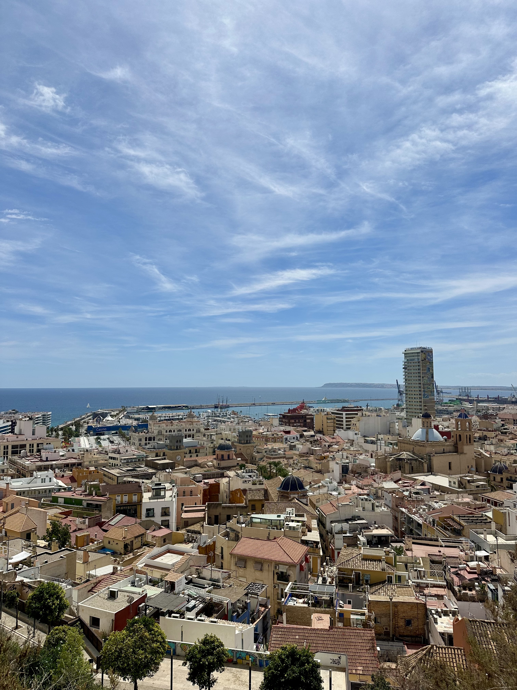
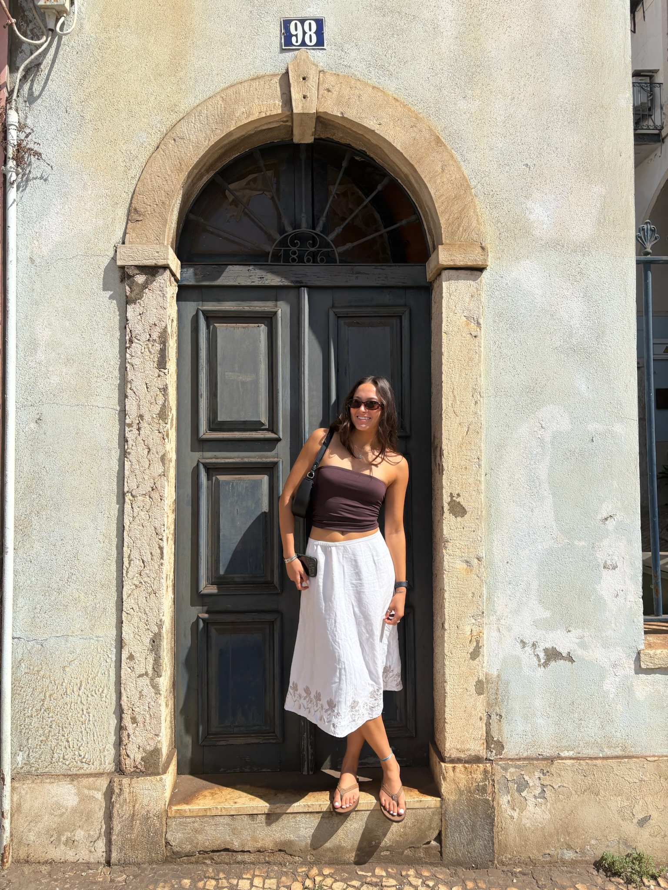
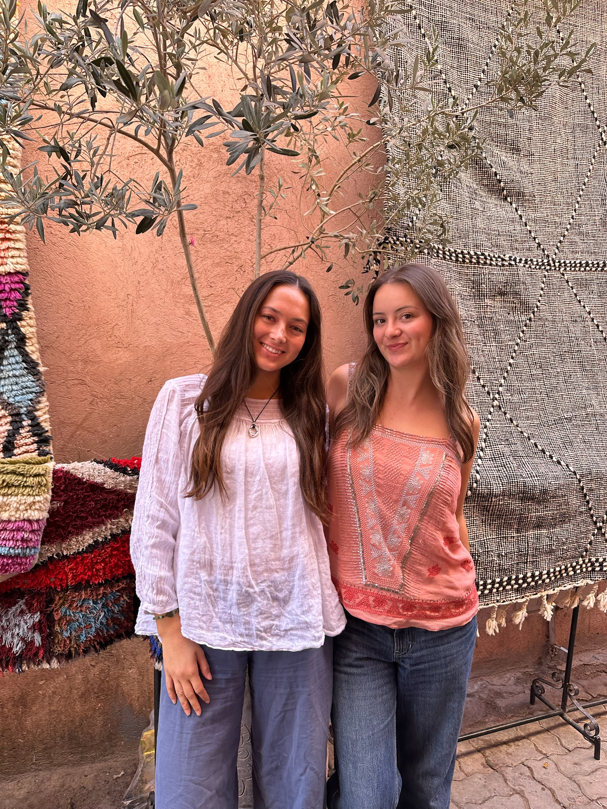
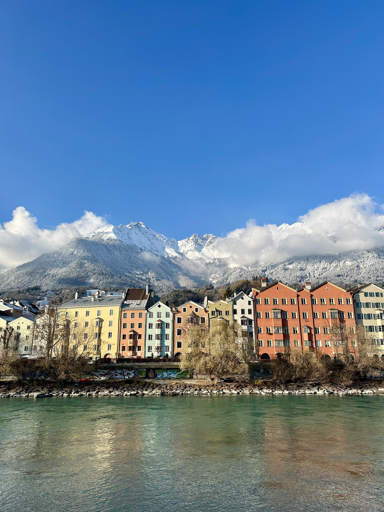

## Hometown

I grew up in Folsom, California which is a small town in Northern California. I often spent my summers outdoors swimming in the lake, taking advantage of the beautiful nature nearby with lots of hikes, and hanging out with friends. Growing up in this town gave me a strong appreciation for the environment. Looking back, my favorite childhood memories were all made outside and this definitely inspired me to purse a degree in Environmental Studies!!

## Family

My family consists of my parents and my older brother and sister. Each of my siblings is two years apart in age, which allowed us to stay close growing up and share a lot of the same experiences. We have two pets, a miniature Australian Shepard named Bailey and a bunny named Stormy. One of the traditions in my household was my parents' summer garden. Every year it required a lot of work to maintain, mainly protection from my dog, but it always produced the best tomatoes, strawberries, cucumbers, and other produce. More recently, my family took a trip to Reykjavik, Iceland where we all completed a half-marathon together! It was definitely one of the most challenging things I've done but it was so rewarding. Being able to accomplish that with my family made the experience even more special and is now one of my favorites memories.

::::::: columns
::: column

:::

::: column

:::

::: column

:::

::: column

:::
:::::::

## Study Abroad

Last quarter I had the opportunity to study abroad in Alicante, Spain. Living in Spain allowed me to immerse myself in a new culture while continuing my studies. This experience easily became one of the most memorable parts of my college experience. In Alicante I was close to the beach and took advantage of it with beach days, sunrise yoga, and nightly sunset walks. While having my home base in Spain, I was lucky enough to travel to several other countries on weekend trips. A few of my favorite places to visit were Portugal, Austria, Morocco, and Germany. Each trip had its own unique culture, food, and scenery, which I loved exploring and learning new things. Studying abroad allowed me to meet many new people from all over the world and pushed me outside of my comfort zone. Overall I am so grateful this experience allowed me to grow in so many ways.

::::::: columns
::: column

:::

::: column

:::

::: column

:::

::: column

:::
:::::::
