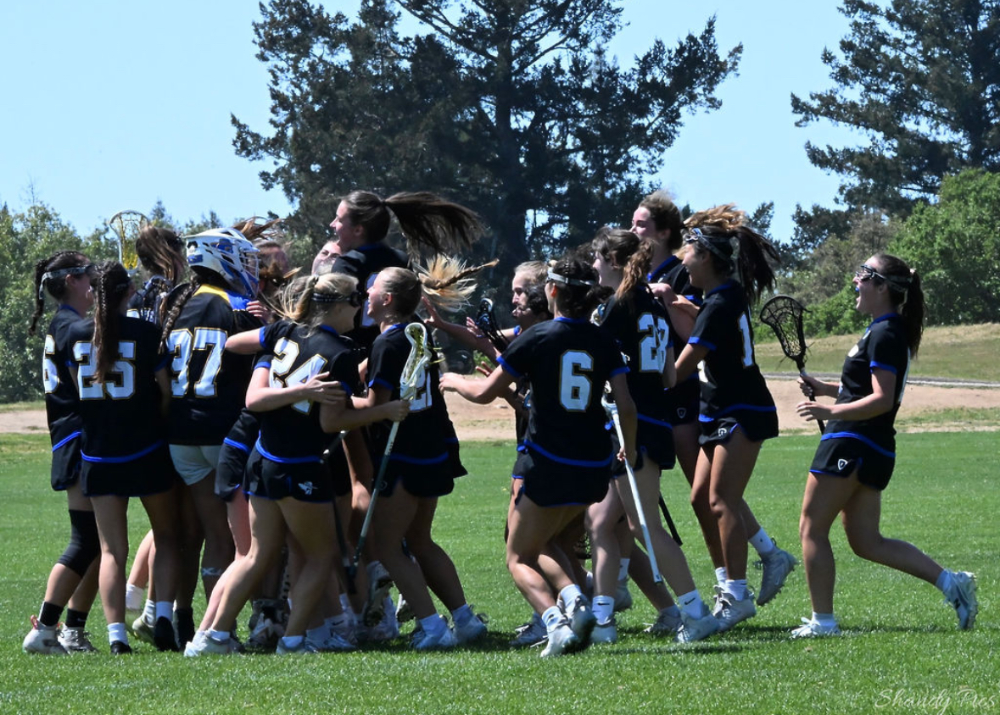
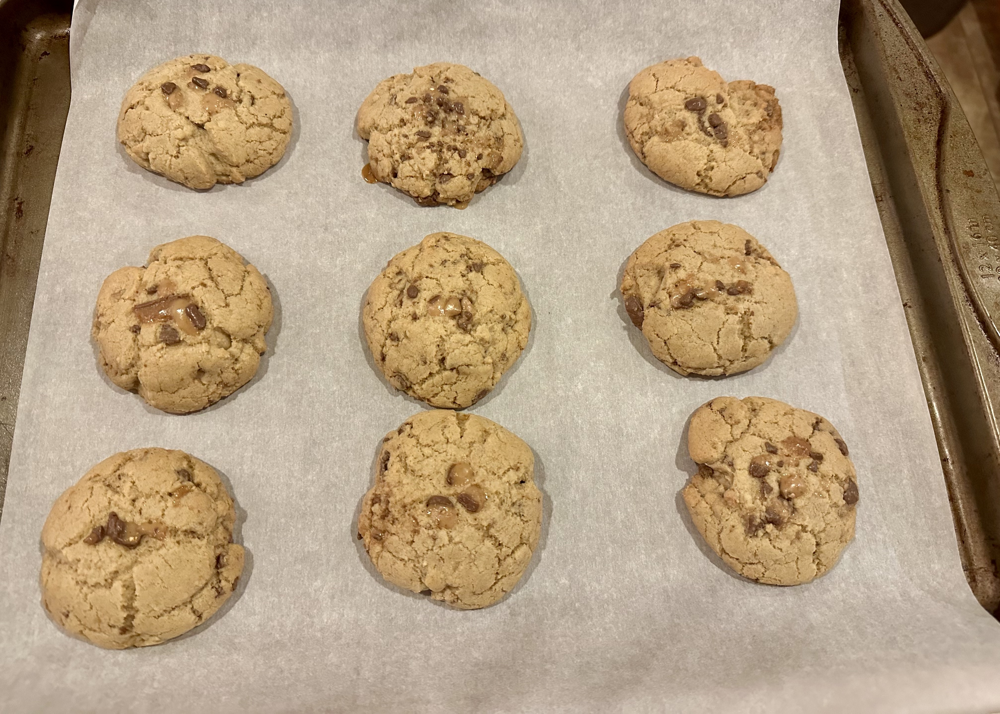
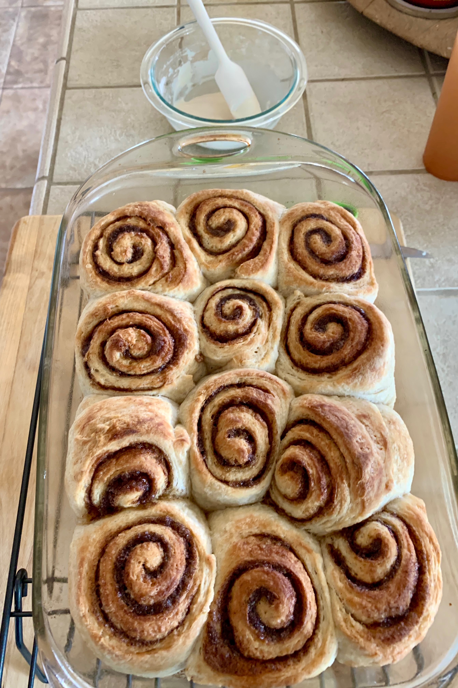

## Lacrosse 

Growing up, I was always active and involved in sports such as soccer, gymnastics, track and field, and swimming. In fifth grade, I watched my brother play a sport called lacrosse and was immediately drawn to it. At the time, the sport was still gaining popularity and there wasn't a girls' team in my hometown. That didn't stop me, I joined the local youth boys' lacrosse team instead. As the only girl on the team, I received my fair share of judgement, but I had began to love the game. Two years later, a youth girls' lacrosse program was finally created in my hometown and I joined. I had to relearn many of the rules since the girls' game differs from the boys'. Although balancing both soccer and lacrosse seasons made my high school years incredibly busy, I wouldn’t have had it any other way.  

Now at UCSB, I play on the club lacrosse team and feel incredibly lucky to be part of such a close-knit and supportive group of teammates—girls I both admire and am proud to call friends. Last year, we placed third in our league playoffs and qualified for Nationals for the first time in over 9 years, finishing 6th overall. This season, we went undefeated in the regular season (15–0) and I'm so excited to compete in playoffs next quarter.

## Baking

Another hobby I enjoy is baking goods. When I was younger, I have fond memories of my mom baking at home, and overtime she shared that hobby with me. It became something we loved doing together and it is still one of my favorite ways to pass time. At home, we keep a sourdough starter that we use to make a variety of baked goods, including sourdough bread, scones, cinnamon rolls, and many other treats. Recently, I made brown butter chocolate chip cookies, which quickly became one of my favorite desserts to bake. For me, baking is both a relaxing hobby and a way I can be creative. I can always count on it whenver I need a break from my busy schedule. 

